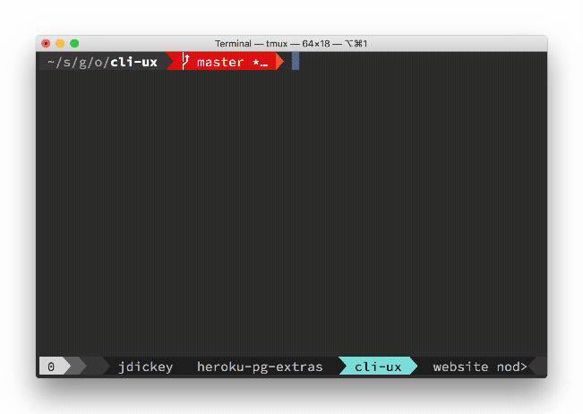
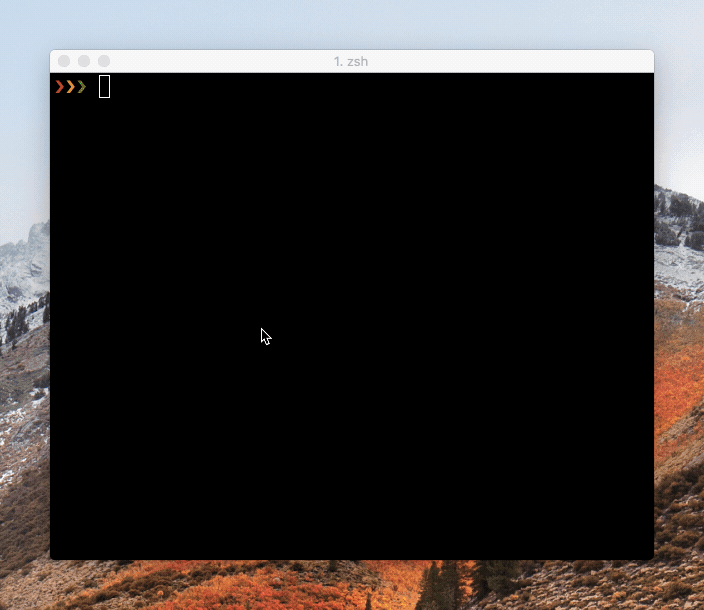
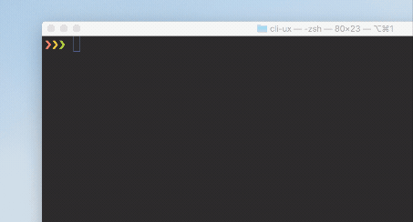
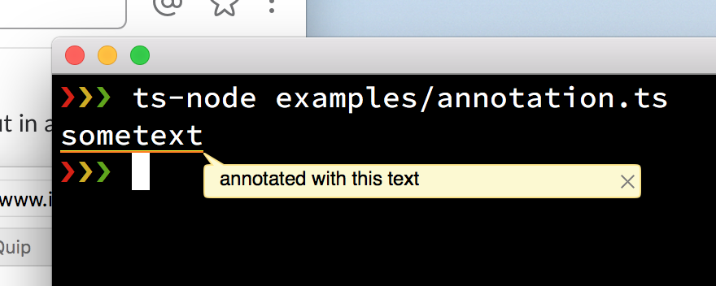

cli-ux
======

cli IO utilities

[](https://npmjs.org/package/cli-ux)
[](https://circleci.com/gh/oclif/cli-ux/tree/master)
[](https://ci.appveyor.com/project/heroku/cli-ux/branch/master)
[](https://codecov.io/gh/oclif/cli-ux)
[](https://greenkeeper.io/)
[](https://snyk.io/test/npm/cli-ux)
[](https://npmjs.org/package/cli-ux)
[](https://github.com/oclif/cli-ux/blob/master/package.json)

# Usage

The following assumes you have installed `cli-ux` to your project with `npm install cli-ux` or `yarn add cli-ux` and have it required in your script (TypeScript example):

```typescript
import cli from 'cli-ux'
cli.prompt('What is your name?')
```

# cli.prompt()

Prompt for user input.

```typescript
// just prompt for input
await cli.prompt('What is your name?')

// mask input after enter is pressed
await cli.prompt('What is your two-factor token?', {type: 'mask'})

// mask input on keypress (before enter is pressed)
await cli.prompt('What is your password?', {type: 'hide'})

// yes/no confirmation
await cli.confirm('Continue?')

// "press any key to continue"
await cli.anykey()
```



# cli.url(text, uri)

Create a hyperlink (if supported in the terminal)

```typescript
await cli.url('sometext', 'https://google.com')
// shows sometext as a hyperlink in supported terminals
// shows https://google.com in unsupported terminals
```



# cli.open

Open a url in the browser

```typescript
await cli.open('https://oclif.io')
```

# cli.action

Shows a spinner

```typescript
// start the spinner
cli.action.start('starting a process')
// show on stdout instead of stderr
cli.action.start('starting a process', {stdout: true})

// stop the spinner
cli.action.stop() // shows 'starting a process... done'
cli.action.stop('custom message') // shows 'starting a process... custom message'
```

This degrades gracefully when not connected to a TTY. It queues up any writes to stdout/stderr so they are displayed above the spinner.



# cli.annotation

Shows an iterm annotation

```typescript
// start the spinner
cli.annotation('sometest', 'annotated with this text')
```



# cli.wait

Waits for 1 second or given milliseconds

```typescript
await cli.wait()
await cli.wait(3000)
```

# cli.supertable

Displays a customizable table

```typescript
cli.supertable.display(data, columns, options)
```

Where:

- `data`: array of data object to display
- `columns`: SuperTable.Columns object (see more below)
- `options`: SuperTable.Options object (see more below)

`SuperTable.Columns` ... foo

`SuperTable.Options` ... foo

`cli.supertable.flags` is an object containing all the flags to include in your command to give users customizable tables

```typescript
const flags = {
  columns: Flags.string({exclusive: ['additional'], description: 'only show provided columns (comma-seperated)'}),
  sort: Flags.string({description: 'property to sort by (prepend \'-\' for descending)'}),
  filter: Flags.string({description: 'filter property by partial string matching, ex: name=foo'}),
  csv: Flags.boolean({exclusive: ['no-truncate'], description: 'output is csv format'}),
  additional: Flags.boolean({description: 'show additional properties'}),
  'no-truncate': Flags.boolean({exclusive: ['csv'], description: 'do not truncate output to fit screen'}),
  'no-header': Flags.boolean({exclusive: ['csv'], description: 'hide table header from output'}),
}
```

```typescript
import {api} from 'my-api-clent'
import {cli} from 'cli-ux'
import {Command} from '@oclif/command'
import {SuperTable} from 'cli-ux/lib/styled/supertable'

export class Users extends Command {
  static flags = {
    ...cli.supertable.flags
  }

  async run() {
    const {flags} = this.parse(User)
    const users = await api.get<any[]>('/users')

    const columns: SuperTable.Columns = {
      name: {
        minWidth: 7,
      },
      team: {
        get: row => row.owner && row.owner.email
      },
      id: {
        header: "ID",
        additional: true
      }
    }

    const options: SuperTable.Options = {
      printLine: this.log,
      ...flags, // parsed flags
    }

    ux.supertable.display(apps, columns, options)
  }
}
```